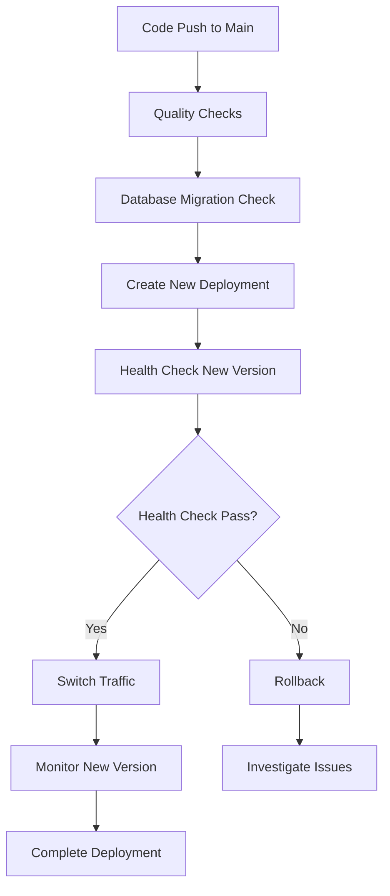

# Production Deployment Guide

Complete guide for deploying Taskorly to production with zero-downtime continuous deployment.

## Table of Contents

1. [Infrastructure Overview](#infrastructure-overview)
2. [Production Environment Setup](#production-environment-setup)
3. [Database Production Setup](#database-production-setup)
4. [CI/CD Pipeline Configuration](#cicd-pipeline-configuration)
5. [Zero-Downtime Deployment Strategy](#zero-downtime-deployment-strategy)
6. [Monitoring & Observability](#monitoring--observability)
7. [Security Hardening](#security-hardening)
8. [Scaling & Performance](#scaling--performance)
9. [Disaster Recovery](#disaster-recovery)

## Infrastructure Overview

### Recommended Production Stack

```
┌─────────────────┐    ┌──────────────────┐    ┌─────────────────┐
│   Vercel Edge   │    │   Supabase       │    │   External      │
│   Network       │    │   Production     │    │   Services      │
│                 │    │                  │    │                 │
│ • Edge Caching  │───▶│ • PostgreSQL     │───▶│ • OpenAI/       │
│ • Auto Scaling  │    │ • Vector Store   │    │   Anthropic     │
│ • SSL/CDN       │    │ • Row Level      │    │ • Monitoring    │
│ • Global Deploy │    │   Security       │    │ • Analytics     │
└─────────────────┘    └──────────────────┘    └─────────────────┘
```

### Architecture Benefits

- **Auto-scaling**: Vercel handles traffic spikes automatically
- **Edge Deployment**: Global CDN with ~50ms latency worldwide
- **Database Isolation**: Supabase provides managed PostgreSQL with built-in security
- **Type Safety**: Full-stack TypeScript with runtime validation

## Production Environment Setup

### 1. Vercel Production Environment

#### 1.1 Create Vercel Project

```bash
# Install Vercel CLI
npm i -g vercel

# Deploy to Vercel
vercel

# Set up production domain
vercel domains add your-domain.com
vercel domains add www.your-domain.com
```

#### 1.2 Configure Environment Variables in Vercel

```bash
# Set production environment variables
vercel env add NEXT_PUBLIC_SUPABASE_URL production
vercel env add NEXT_PUBLIC_SUPABASE_ANON_KEY production
vercel env add SUPABASE_SERVICE_ROLE_KEY production
vercel env add ENCRYPTION_KEY production
vercel env add NEXTAUTH_SECRET production
vercel env add NEXTAUTH_URL production

# Optional AI provider keys
vercel env add OPENAI_API_KEY production
vercel env add ANTHROPIC_API_KEY production
vercel env add GOOGLE_API_KEY production
```

#### 1.3 Production Environment Variables Template

```bash
# Database (Required)
NEXT_PUBLIC_SUPABASE_URL=https://your-prod-project.supabase.co
NEXT_PUBLIC_SUPABASE_ANON_KEY=eyJ0eXAiOiJKV1QiLCJhbGc...
SUPABASE_SERVICE_ROLE_KEY=eyJ0eXAiOiJKV1QiLCJhbGc...

# Security (Required)
ENCRYPTION_KEY=abcdefghijklmnopqrstuvwxyz123456  # Exactly 32 characters
NEXTAUTH_SECRET=your-super-secure-production-secret
NEXTAUTH_URL=https://your-domain.com

# Node Environment
NODE_ENV=production

# AI Providers (Optional)
OPENAI_API_KEY=sk-prod-...
ANTHROPIC_API_KEY=your-prod-anthropic-key
GOOGLE_API_KEY=your-prod-google-key

# MCP Configuration
MCP_SERVER_TIMEOUT=30000
MCP_MAX_RETRIES=3
```

### 2. Supabase Production Setup

#### 2.1 Create Production Supabase Project

1. Go to [supabase.com](https://supabase.com)
2. Create new project with production-grade settings:
   - **Region**: Choose closest to your users
   - **Plan**: Pro or Team for production workloads
   - **Database Password**: Strong, unique password

#### 2.2 Configure Production Database

```sql
-- Run this in Supabase SQL Editor for production
-- Copy from setup-database.sql with production optimizations

-- Enable required extensions
CREATE EXTENSION IF NOT EXISTS "uuid-ossp";
CREATE EXTENSION IF NOT EXISTS "vector";
CREATE EXTENSION IF NOT EXISTS "pg_stat_statements"; -- Performance monitoring

-- Production-optimized indexes
CREATE INDEX CONCURRENTLY IF NOT EXISTS idx_users_tenant_id_active ON users(tenant_id) WHERE deleted_at IS NULL;
CREATE INDEX CONCURRENTLY IF NOT EXISTS idx_documents_tenant_search ON documents USING gin(to_tsvector('english', title || ' ' || content));
CREATE INDEX CONCURRENTLY IF NOT EXISTS idx_document_chunks_embedding ON document_chunks USING ivfflat (embedding vector_cosine_ops) WITH (lists = 100);

-- Performance monitoring
CREATE OR REPLACE VIEW performance_stats AS
SELECT
    schemaname,
    tablename,
    attname,
    n_distinct,
    correlation
FROM pg_stats
WHERE schemaname = 'public';
```

#### 2.3 Production RLS Policies

```sql
-- Production security policies
CREATE POLICY "Production tenant isolation" ON users
  FOR ALL TO authenticated
  USING (
    tenant_id IN (
      SELECT tenant_id FROM users
      WHERE id = auth.uid()
      AND deleted_at IS NULL
    )
  );

-- Rate limiting policy
CREATE OR REPLACE FUNCTION rate_limit_check(user_id uuid, operation text, max_requests int, time_window interval)
RETURNS boolean AS $$
BEGIN
  -- Check if user has exceeded rate limit
  IF (
    SELECT COUNT(*)
    FROM usage_logs
    WHERE user_id = rate_limit_check.user_id
    AND operation = rate_limit_check.operation
    AND created_at > NOW() - time_window
  ) >= max_requests THEN
    RETURN false;
  END IF;
  RETURN true;
END;
$$ LANGUAGE plpgsql SECURITY DEFINER;
```

#### 2.4 Database Backup Strategy

```sql
-- Automated backups (configured in Supabase Dashboard)
-- Point-in-time recovery enabled
-- Daily automated backups retained for 30 days
-- Weekly backups retained for 3 months
-- Monthly backups retained for 1 year
```

## CI/CD Pipeline Configuration

### 3.1 GitHub Actions Workflow

Create `.github/workflows/production-deploy.yml`:

```yaml
name: Production Deployment

on:
  push:
    branches: [main]
  pull_request:
    branches: [main]

env:
  VERCEL_ORG_ID: ${{ secrets.VERCEL_ORG_ID }}
  VERCEL_PROJECT_ID: ${{ secrets.VERCEL_PROJECT_ID }}

jobs:
  quality-checks:
    runs-on: ubuntu-latest
    steps:
      - uses: actions/checkout@v4

      - name: Setup Node.js
        uses: actions/setup-node@v4
        with:
          node-version: '18'
          cache: 'npm'

      - name: Install dependencies
        run: npm ci

      - name: Type check
        run: npm run type-check

      - name: Lint (strict)
        run: npm run lint:strict

      - name: Format check
        run: npm run format:check

      - name: Security audit
        run: npm audit --audit-level high

      - name: Run tests
        run: npm run test

      - name: E2E tests
        run: npm run test:e2e

  database-migration-check:
    runs-on: ubuntu-latest
    if: github.event_name == 'pull_request'
    steps:
      - uses: actions/checkout@v4

      - name: Setup Supabase CLI
        uses: supabase/setup-cli@v1
        with:
          version: latest

      - name: Validate migrations
        run: |
          supabase db diff --schema public --file migration_check.sql
          echo "Migration validation completed"

  preview-deployment:
    runs-on: ubuntu-latest
    needs: [quality-checks]
    if: github.event_name == 'pull_request'
    steps:
      - uses: actions/checkout@v4

      - name: Install Vercel CLI
        run: npm install --global vercel@latest

      - name: Deploy to Preview
        run: |
          vercel deploy --token=${{ secrets.VERCEL_TOKEN }} > preview_url.txt
          echo "PREVIEW_URL=$(cat preview_url.txt)" >> $GITHUB_ENV

      - name: Comment PR with preview URL
        uses: actions/github-script@v7
        with:
          script: |
            github.rest.issues.createComment({
              issue_number: context.issue.number,
              owner: context.repo.owner,
              repo: context.repo.repo,
              body: `🚀 Preview deployment: ${process.env.PREVIEW_URL}`
            })

  production-deployment:
    runs-on: ubuntu-latest
    needs: [quality-checks, database-migration-check]
    if: github.ref == 'refs/heads/main'
    environment: production
    steps:
      - uses: actions/checkout@v4

      - name: Install Vercel CLI
        run: npm install --global vercel@latest

      - name: Database Migration (if needed)
        env:
          SUPABASE_ACCESS_TOKEN: ${{ secrets.SUPABASE_ACCESS_TOKEN }}
          SUPABASE_PROJECT_ID: ${{ secrets.SUPABASE_PROJECT_ID }}
        run: |
          # Run migrations with zero-downtime strategy
          npm run db:migrate:production

      - name: Deploy to Production
        run: |
          vercel deploy --prod --token=${{ secrets.VERCEL_TOKEN }}

      - name: Health Check
        run: |
          sleep 30  # Wait for deployment to stabilize
          curl -f https://your-domain.com/api/health || exit 1

      - name: Notify team
        if: success()
        run: |
          echo "✅ Production deployment successful"
          # Add Slack/Discord notification here
```

### 3.2 Required GitHub Secrets

```bash
# Vercel Integration
VERCEL_TOKEN=your-vercel-token
VERCEL_ORG_ID=your-org-id
VERCEL_PROJECT_ID=your-project-id

# Supabase Integration
SUPABASE_ACCESS_TOKEN=your-supabase-access-token
SUPABASE_PROJECT_ID=your-supabase-project-id

# Production Environment Variables (same as Vercel env vars)
NEXT_PUBLIC_SUPABASE_URL=...
SUPABASE_SERVICE_ROLE_KEY=...
ENCRYPTION_KEY=...
# ... etc
```

## Zero-Downtime Deployment Strategy

### 4.1 Deployment Flow



### 4.2 Database Migration Strategy

```sql
-- Migration script template for zero-downtime
-- migrations/production/[timestamp]_migration_name.sql

BEGIN;

-- Step 1: Add new columns (non-breaking)
ALTER TABLE users ADD COLUMN new_feature_flag boolean DEFAULT false;

-- Step 2: Create indexes concurrently (non-blocking)
CREATE INDEX CONCURRENTLY idx_users_new_feature ON users(new_feature_flag) WHERE new_feature_flag = true;

-- Step 3: Add new tables
CREATE TABLE new_feature_settings (
    id uuid PRIMARY KEY DEFAULT gen_random_uuid(),
    user_id uuid REFERENCES users(id) ON DELETE CASCADE,
    settings jsonb DEFAULT '{}',
    created_at timestamptz DEFAULT NOW()
);

-- Step 4: Enable RLS on new tables
ALTER TABLE new_feature_settings ENABLE ROW LEVEL SECURITY;

-- Step 5: Create policies
CREATE POLICY "Users can manage their feature settings" ON new_feature_settings
  FOR ALL TO authenticated
  USING (user_id = auth.uid());

COMMIT;
```

### 4.3 Feature Flag Implementation

```typescript
// src/lib/feature-flags.ts
export const featureFlags = {
  NEW_CHAT_INTERFACE: process.env.NODE_ENV === 'production'
    ? process.env.FEATURE_NEW_CHAT_INTERFACE === 'true'
    : true,
  ADVANCED_ANALYTICS: process.env.FEATURE_ADVANCED_ANALYTICS === 'true',
  BETA_RAG_PIPELINE: process.env.FEATURE_BETA_RAG_PIPELINE === 'true',
} as const;

// Usage in components
export function ChatInterface() {
  if (featureFlags.NEW_CHAT_INTERFACE) {
    return <NewChatInterface />;
  }
  return <LegacyChatInterface />;
}
```

### 4.4 Health Check Implementation

```typescript
// src/app/api/health/route.ts - Enhanced for production
import { NextResponse } from 'next/server';
import { supabaseAdmin } from '@/lib/supabase';

export async function GET() {
  const health = {
    status: 'healthy',
    timestamp: new Date().toISOString(),
    version: process.env.npm_package_version || '1.0.0',
    environment: process.env.NODE_ENV,
    checks: {
      database: 'healthy',
      redis: 'healthy', // if using Redis
      external_apis: 'healthy',
    },
  };

  try {
    // Database health check
    const { data, error } = await supabaseAdmin.from('tenants').select('count').limit(1).single();

    if (error) {
      health.checks.database = 'unhealthy';
      health.status = 'unhealthy';
    }

    // External API health checks
    const apiChecks = await Promise.allSettled([
      fetch('https://api.openai.com/v1/models', {
        headers: { Authorization: `Bearer ${process.env.OPENAI_API_KEY}` },
      }).then(r => r.ok),
      // Add other API health checks
    ]);

    const failedChecks = apiChecks.filter(check => check.status === 'rejected');
    if (failedChecks.length > 0) {
      health.checks.external_apis = 'degraded';
    }

    return NextResponse.json(health, {
      status: health.status === 'healthy' ? 200 : 503,
    });
  } catch (error) {
    return NextResponse.json(
      {
        status: 'unhealthy',
        error: 'Health check failed',
      },
      { status: 503 }
    );
  }
}
```

## Monitoring & Observability

### 5.1 Application Monitoring

```typescript
// src/lib/monitoring.ts
import { NextRequest } from 'next/server';

export class ProductionMonitoring {
  static async logRequest(req: NextRequest, response: any) {
    const monitoring = {
      timestamp: new Date().toISOString(),
      method: req.method,
      url: req.url,
      userAgent: req.headers.get('user-agent'),
      responseTime: Date.now() - performance.now(),
      statusCode: response.status,
      userId: req.headers.get('x-user-id'), // if available
      tenantId: req.headers.get('x-tenant-id'), // if available
    };

    // Send to monitoring service (DataDog, NewRelic, etc.)
    await fetch(process.env.MONITORING_WEBHOOK_URL!, {
      method: 'POST',
      headers: { 'Content-Type': 'application/json' },
      body: JSON.stringify(monitoring),
    });
  }

  static async logError(error: Error, context: any) {
    const errorLog = {
      timestamp: new Date().toISOString(),
      error: {
        message: error.message,
        stack: error.stack,
        name: error.name,
      },
      context,
      environment: process.env.NODE_ENV,
      version: process.env.npm_package_version,
    };

    // Send to error tracking (Sentry, Bugsnag, etc.)
    console.error('Production Error:', errorLog);
  }
}
```

### 5.2 Performance Monitoring

```sql
-- Database performance monitoring queries
-- Run these regularly to track production performance

-- Slow queries
SELECT
  query,
  calls,
  total_time,
  mean_time,
  rows,
  100.0 * shared_blks_hit / nullif(shared_blks_hit + shared_blks_read, 0) AS hit_percent
FROM pg_stat_statements
ORDER BY total_time DESC
LIMIT 10;

-- Table sizes and growth
SELECT
  schemaname,
  tablename,
  pg_size_pretty(pg_relation_size(schemaname||'.'||tablename)) AS size,
  pg_size_pretty(pg_total_relation_size(schemaname||'.'||tablename)) AS total_size
FROM pg_tables
WHERE schemaname = 'public'
ORDER BY pg_total_relation_size(schemaname||'.'||tablename) DESC;

-- Connection monitoring
SELECT
  state,
  COUNT(*) as connections,
  AVG(EXTRACT(EPOCH FROM (now() - state_change))) as avg_duration
FROM pg_stat_activity
WHERE datname = current_database()
GROUP BY state;
```

## Security Hardening

### 6.1 Production Security Checklist

- [ ] **Environment Variables**: No hardcoded secrets in code
- [ ] **API Keys**: Encrypted storage with AES-256-GCM
- [ ] **Database Access**: RLS policies enforced
- [ ] **HTTPS Only**: SSL certificates and HSTS headers
- [ ] **Rate Limiting**: Per-user and per-IP limits
- [ ] **Input Validation**: Zod schemas on all inputs
- [ ] **CORS Configuration**: Restrict to production domains
- [ ] **Security Headers**: CSP, XSS protection, etc.

### 6.2 Security Headers Configuration

```typescript
// next.config.js - Production security headers
const nextConfig = {
  async headers() {
    return [
      {
        source: '/(.*)',
        headers: [
          {
            key: 'X-DNS-Prefetch-Control',
            value: 'on',
          },
          {
            key: 'Strict-Transport-Security',
            value: 'max-age=63072000; includeSubDomains; preload',
          },
          {
            key: 'X-XSS-Protection',
            value: '1; mode=block',
          },
          {
            key: 'X-Frame-Options',
            value: 'DENY',
          },
          {
            key: 'X-Content-Type-Options',
            value: 'nosniff',
          },
          {
            key: 'Referrer-Policy',
            value: 'origin-when-cross-origin',
          },
          {
            key: 'Content-Security-Policy',
            value:
              "default-src 'self'; script-src 'self' 'unsafe-eval' 'unsafe-inline' *.vercel-analytics.com; style-src 'self' 'unsafe-inline'; img-src 'self' data: blob:; font-src 'self'; connect-src 'self' *.supabase.co *.openai.com *.anthropic.com *.googleapis.com",
          },
        ],
      },
    ];
  },
};
```

## Scaling & Performance

### 7.1 Auto-Scaling Configuration

```javascript
// vercel.json - Production optimization
{
  "functions": {
    "app/api/chat/**/*.js": {
      "maxDuration": 30
    },
    "app/api/documents/**/*.js": {
      "maxDuration": 60
    }
  },
  "headers": [
    {
      "source": "/api/(.*)",
      "headers": [
        {
          "key": "Cache-Control",
          "value": "s-maxage=0, max-age=0"
        }
      ]
    },
    {
      "source": "/_next/static/(.*)",
      "headers": [
        {
          "key": "Cache-Control",
          "value": "public, max-age=31536000, immutable"
        }
      ]
    }
  ]
}
```

### 7.2 Database Scaling Strategy

```sql
-- Production database optimizations
-- Connection pooling configuration
ALTER SYSTEM SET max_connections = 200;
ALTER SYSTEM SET shared_preload_libraries = 'pg_stat_statements';
ALTER SYSTEM SET track_activity_query_size = 2048;
ALTER SYSTEM SET log_min_duration_statement = 1000; -- Log slow queries

-- Query optimization
ANALYZE; -- Update table statistics
REINDEX; -- Rebuild indexes monthly

-- Partitioning for large tables (usage_logs example)
CREATE TABLE usage_logs_y2024m01 PARTITION OF usage_logs
FOR VALUES FROM ('2024-01-01') TO ('2024-02-01');

-- Archive old data
DELETE FROM usage_logs WHERE created_at < NOW() - INTERVAL '1 year';
```

## Disaster Recovery

### 8.1 Backup Strategy

```bash
#!/bin/bash
# scripts/backup-production.sh

# Daily backup script
BACKUP_DATE=$(date +%Y%m%d_%H%M%S)
BACKUP_DIR="/backups/taskorly-prod"

# Database backup via Supabase CLI
supabase db dump \
  --project-id $SUPABASE_PROJECT_ID \
  --password $SUPABASE_DB_PASSWORD \
  > "$BACKUP_DIR/db_backup_$BACKUP_DATE.sql"

# Environment variables backup (encrypted)
gpg --cipher-algo AES256 --compress-algo 1 --s2k-mode 3 \
  --s2k-digest-algo SHA512 --s2k-count 65536 --symmetric \
  --output "$BACKUP_DIR/env_backup_$BACKUP_DATE.gpg" \
  .env.production

# Upload to secure cloud storage
aws s3 cp "$BACKUP_DIR/" s3://taskorly-backups/ --recursive
```

### 8.2 Recovery Procedures

```bash
#!/bin/bash
# scripts/disaster-recovery.sh

# 1. Restore database from backup
supabase db reset --project-id $SUPABASE_PROJECT_ID
psql -h $SUPABASE_HOST -U $SUPABASE_USER -f backup_file.sql

# 2. Redeploy application
vercel deploy --prod --token=$VERCEL_TOKEN

# 3. Verify health
curl -f https://your-domain.com/api/health

# 4. Update DNS if needed (if switching providers)
# Update A records to point to new infrastructure
```

### 8.3 Business Continuity Plan

1. **RTO (Recovery Time Objective)**: 15 minutes
2. **RPO (Recovery Point Objective)**: 1 hour
3. **Backup Schedule**:
   - Database: Every 4 hours
   - Application: Continuous (Git)
   - Environment: Daily

## Production Deployment Checklist

### Pre-Deployment

- [ ] All tests passing (unit, integration, E2E)
- [ ] Security audit completed
- [ ] Performance benchmarks meet requirements
- [ ] Database migrations tested on staging
- [ ] Feature flags configured
- [ ] Monitoring and alerting set up
- [ ] Backup procedures tested
- [ ] Rollback plan documented

### Deployment

- [ ] Database migrations applied
- [ ] Application deployed via CI/CD
- [ ] Health checks passing
- [ ] Traffic gradually shifted to new version
- [ ] Monitoring dashboards show normal metrics
- [ ] Error rates within acceptable limits

### Post-Deployment

- [ ] User acceptance testing completed
- [ ] Performance monitoring for 24 hours
- [ ] No critical errors in logs
- [ ] Customer feedback monitored
- [ ] Team notified of successful deployment

---

This production setup provides enterprise-grade deployment with zero-downtime updates, comprehensive
monitoring, and robust disaster recovery. The architecture scales automatically and maintains high
availability while ensuring security best practices.
